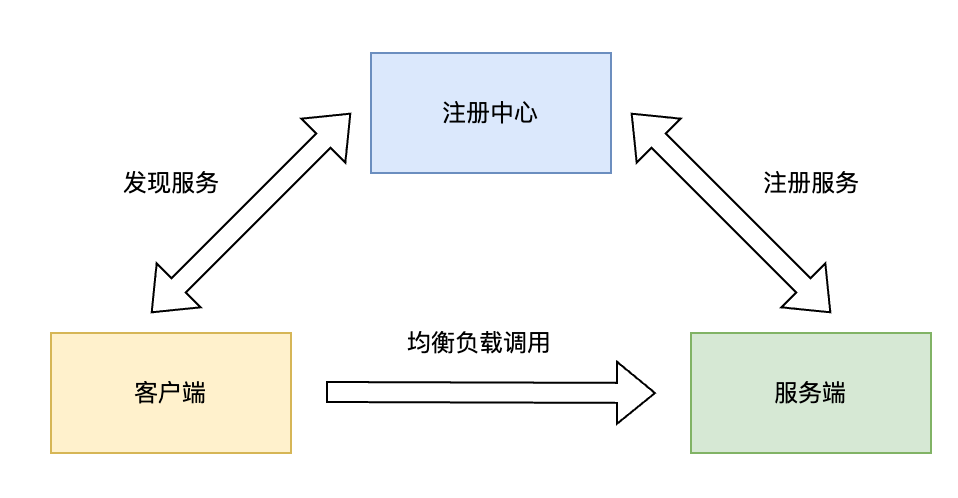

## 概述

ImDubbo 框架是一个轻量级、高性能的分布式服务调用框架。参考 Dubbo 框架的实现，基于 Netty 实现网络通信，使用 ZooKeeper 作为服务注册中心，支持服务自动发现、负载均衡和容错机制。

## 特性

- ✅ 基于 Netty 的高性能网络通信
- ✅ ZooKeeper 服务注册与发现
- ✅ 多种负载均衡策略（随机、轮询、一致性哈希）
- ✅ 多种序列化方式（JSON、Hessian、Protobuf、Kryo）
- ✅ 同步/异步调用支持
- ✅ 服务治理（连接管理、超时控制）
- ✅ 注解驱动开发
- ✅ 心跳检测与重连机制

## 整体架构



整体调用过程：

1. **服务者启动**：服务提供者启动时向注册中心
2. **消费者启动**：扫描指定包路径，为带有RPC注解的属性/方法所在类创建代理对象
3. **方法调用**：消费者调用远程方法，内部实际调用代理对象的方法
4. **服务发现** ：消费者从注册中心获取服务地址列表
5. **负载均衡**：消费者根据策略选择服务实例
6. **序列化**：消费者包装新的请求，并把请求体序列化
7. **网络通信**：通过 Netty 进行远程调用
8. **反序列化**：服务者接收到请求，进行反序列化，获取请求体内容
9. **结果返回**：服务端处理请求并返回结果，同样经历序列化 —> 网络通信 —> 反序列化的过程

## 项目结构

```
.
├── dubbo-all          #项目依赖集合
├── dubbo-client       #实现客户端注册
├── dubbo-common       #通用工具，例如RPC注解、序列化器、抽象模型等
├── dubbo-demo         #使用示例
├── dubbo-registry     #注册中心
├── dubbo-rpc          #远程调用相关，包括代理类、均衡负载器
├── dubbo-server       #实现服务端注册
└── dubbo-spring-boot  #stater工具
```

## 使用示例

> 注册中心为 Zookeeper，在使用前需要先运行 Zookeeper 服务。详细可参考 dubbo-demo 项目。

1、把需要远程调用的接口方法放在一个单独的 API 模块，例如 `dubbo-demo-api`

```java
public interface HelloService {

    String hello();

}
```

2、引入maven依赖

```xml
<dependency>
    <groupId>com.mcb</groupId>
    <artifactId>dubbo-spring-boot-starter</artifactId>
    <version>1.0-SNAPSHOT</version>
</dependency>

<dependency>
    <groupId>com.mcb</groupId>
    <artifactId>dubbo-demo-api</artifactId>
    <version>1.0-SNAPSHOT</version>
    <scope>provided</scope>
</dependency>
```

3、生产者配置

```yaml
server:
  port: 9000

spring:
  application:
    name: dubbo-demo-provider

imdubbo:
  application:
    name: ${spring.application.name}
  registry:
    type: provider
    address: zookeeper://127.0.0.1:2181
    sessionTimeout: 5000
    connectionTimeout: 5000
  protocol:
    name: http
    port: 9001
```

4、消费者配置

```yaml
server:
  port: 8000

spring:
  application:
    name: dubbo-demo-consumer

imdubbo:
  application:
    name: ${spring.application.name}
  registry:
    type: consumer
    address: zookeeper://127.0.0.1:2181
    sessionTimeout: 5000
    connectionTimeout: 5000
  protocol:
    name: http
```

5、生产者实现示例

```java
@RpcService
public class HelloServiceImpl implements HelloService {

    @Override
    public String hello() {
        return "Test Hello";
    }
}
```

6、生产者调用示例

```java
@RestController
@RequestMapping("/hello")
public class HelloController {

    @RpcReference
    HelloService testService;

    @GetMapping("/test")
    public String test() {
        return testService.hello();
    }
}
```

7、测试。调用 http://localhost:8000/hello/test，返回 "Test Hello"，表示远程调用成功。
